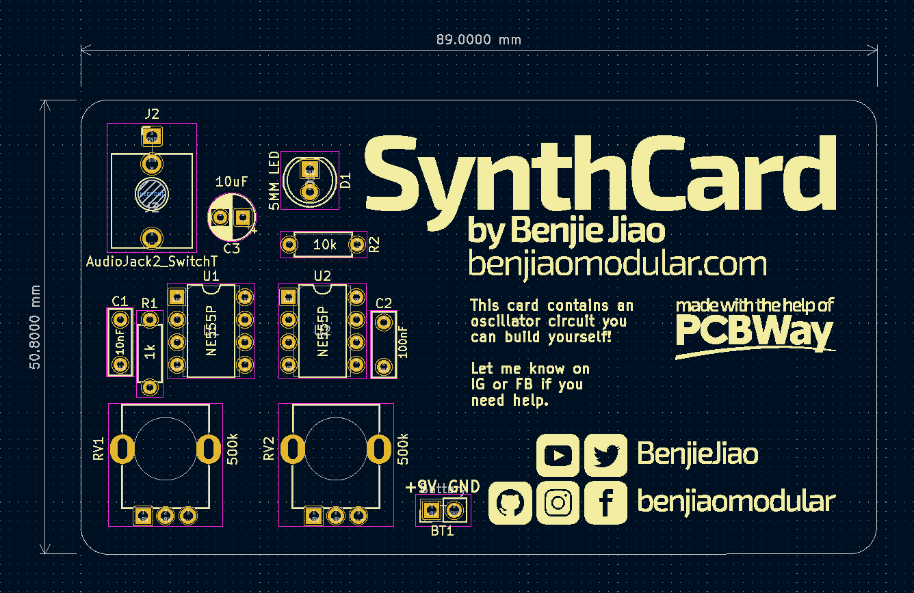
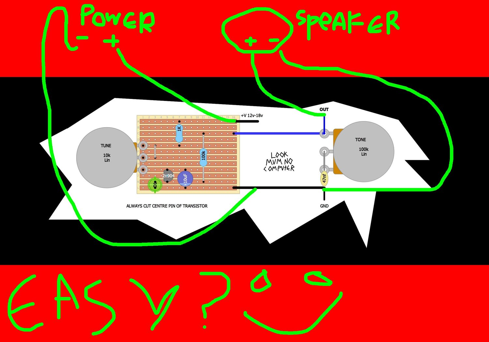
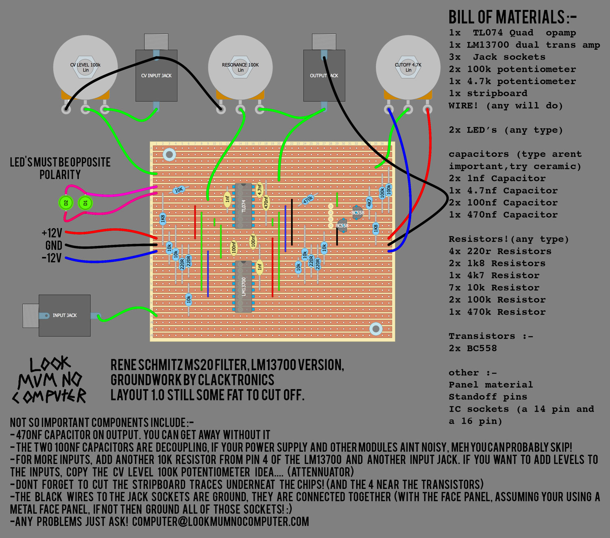

# SynthCard
Another SynthCard based on **BenjiaoModular's** SynthCard standard but using Eurorack format power (±12V)

Original: https://github.com/benjiaomodular/SynthCard/blob/main/

## Version 0.1 - Initial Commit

Initial version of my SynthCard. 

|Process|Status|Time|
|-------|------|----|
|PCB|Designed|-|
|Fabrication|Done|-|
|Build|Done|-|
|Test|Done|-|

Features:
- LMNC Simplest Oscillator with tone control (https://www.lookmumnocomputer.com/simplest-oscillator)

- Rene Schmitz MS-20 Filter based on LMNC's Stripboard design (https://www.lookmumnocomputer.com/simple-filter)

Issues:
- Missing line (Fixed)
- Oscillator level too low
- Oscillator range is to small (Fixed) (See Oscillator notes)
- Tone knob wired in backwards (Fixed)
- Pitch CV IN is actually OSC OUT without Tone (Fixed)
- I want to make seperate input for the filter so external audio can be processed (Fixed)

## Version 1.1 - Under development

|Process|Status|Time|
|-------|------|----|
|PCB|Designed|-|
|Fabrication|Not Done|-|
|Build|Not Done|-|
|Test|Not Done|-|

Fixed Issues:
- Missing Line
- Tone is wired in correctly
- Lable for Pitch CV IN changed to OSC OUT with Tone
- Seperate input for VCF added

New Issues:
- Not tested yet

## Oscillator Notes
To address oscillator range is to small:

Change electrolytic capacitor value; the smaller the capacitor value the quicker it oscillates.
Suggested values:
|Range|Value|
|-----|-----|
|Bass|100uf|
|Tenor|33uf|
|Alto|10uf|

Credits: Paul Bergels Triple Skulls Oscillators